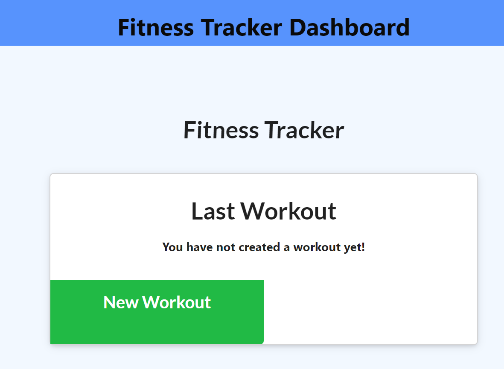

[](http://unlicense.org/)

## Task
For this assignment, you'll create a workout tracker. You have already been provided with the front end code in the `Develop` folder. This assignment will require you to create Mongo database with a Mongoose schema and handle routes with Express.

<!-- https://devcenter.heroku.com/articles/deploying-nodejs - Deploying in Heroku -->
--------------------------------

### ResponseUI Solution - Desktop, Tablet & Mobile Views
Login Screen:  <br>

## Grading Requirements

You are required to submit the following:
```
✅ The URL to the deployed application
✅ The URL to the GitHub repository
```
# Resources: 
Submission: 🗂️ [Github Repository](https://github.com/cakspri/Fitness-Tracker) |  📄[Heroku Page](https://calm-cove-09758.herokuapp.com/)
